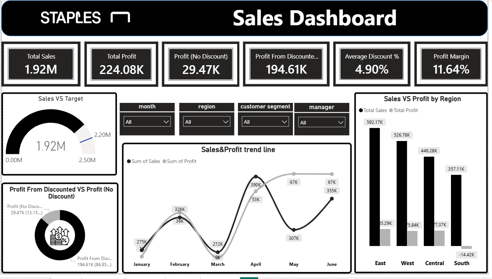
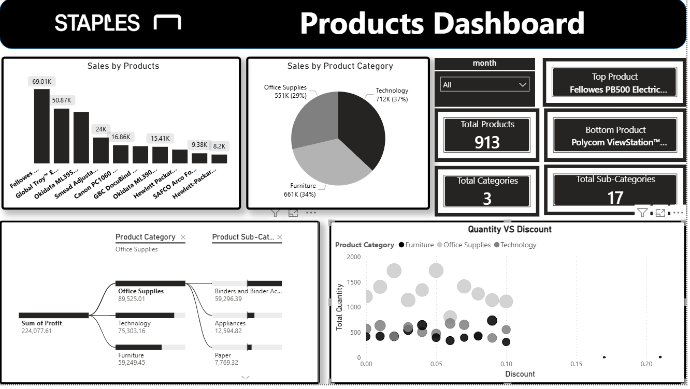
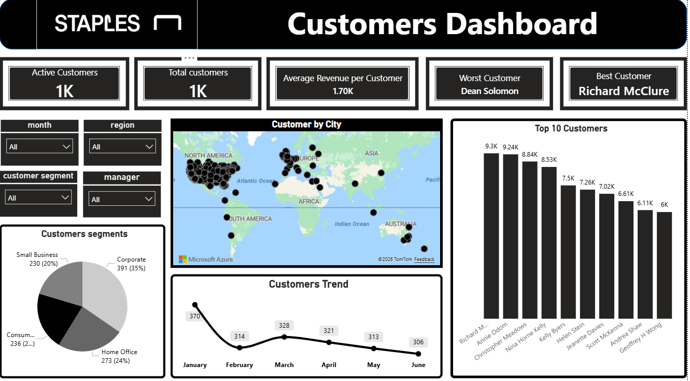
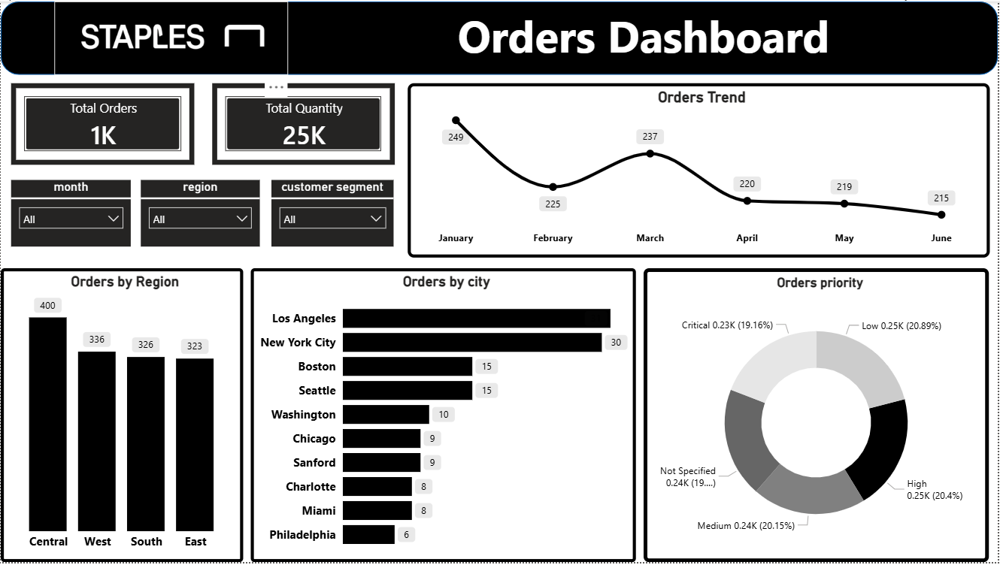
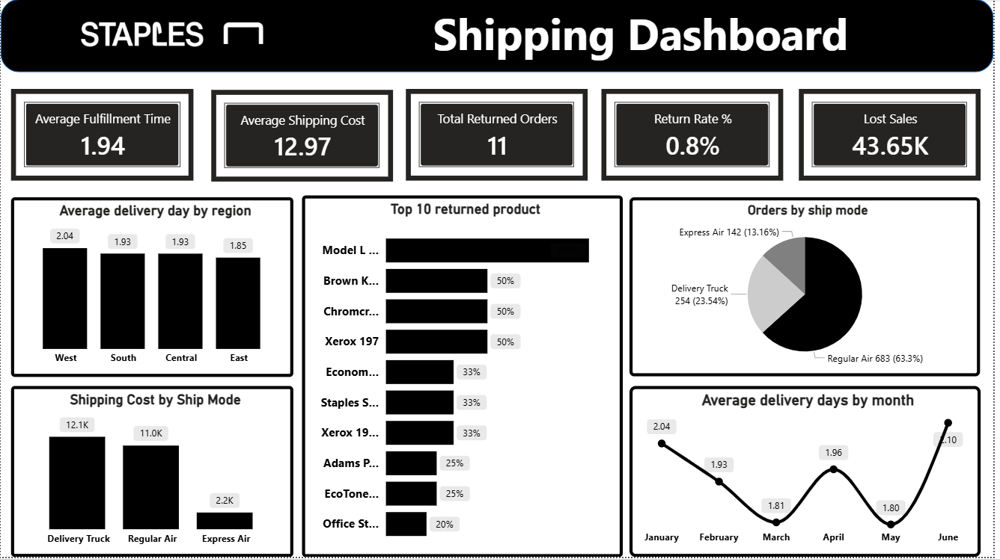

# Staples SuperStore — Sales & Operations Analysis Dashboard

An end-to-end interactive dashboard built on the **SuperStore US (2015)** dataset, covering sales performance, product profitability, customer behavior, order patterns, and shipping/logistics efficiency.

---

## Overview

This project analyzes **1,365 distinct orders** (1,952 order line items) placed between **January and June 2015** across four US regions (East, West, Central, South), covering three product categories and 17 sub-categories. The goal was to turn raw transactional data into a set of decision-ready dashboards for a retail business — tracking revenue against target, identifying which products/regions drive profit vs. loss, understanding customer value, and monitoring order fulfillment and shipping performance.

**Key headline numbers:**

| Metric | Value |
|---|---|
| Total Sales | $1.92M |
| Total Profit | $224.08K |
| Profit Margin | 11.64% |
| Average Discount | 4.90% |
| Total Orders | 1,365 (1,952 line items) |
| Total Quantity Sold | 25,268 units |
| Total Products | 913 (3 categories / 17 sub-categories) |
| Average Fulfillment Time | 1.94 days |
| Return Rate | 0.8% |

---

### Data notes
- The `Orders` sheet has 1,952 rows, but each row is a **line item** (one product within an order), not a separate order. Counting distinct `Order ID` values gives **1,365 actual orders** — this is the figure used throughout the dashboards and this README, not the raw row count.
- The `Returns` sheet contains order IDs from a larger historical export; only 11 of those IDs actually match orders in this 6-month subset, which is why "Total Returned Orders" is low relative to the full returns list. Treat the 0.8% return rate as specific to this dataset's scope, not the full historical returns population.

---

## Dashboards

### 1. Sales Dashboard

- Total Sales of $1.92M sits at ~87% of the $2.20M target.
- Discounted orders generated the large majority of profit ($194.61K, ~87%) versus non-discounted orders ($29.47K) — a sign that discounting is closely tied to volume in this dataset.
- **East** is the strongest region ($592K sales / $85.3K profit); **South** is the only region operating at a **loss** (–$14.4K profit) despite $357K in sales — flagged as a priority area for margin investigation.

### 2. Products Dashboard

- 913 products across Technology, Office Supplies, and Furniture.
- **Technology** leads in revenue ($712K, 37%), but **Office Supplies** actually generates the most profit ($89.5K) — a margin gap worth digging into for pricing/discount strategy on Technology items.
- Top product: *Fellowes PB500 Electric...*; lowest performer: *Polycom ViewStation™...*.
- Discount rates cluster below 10% for most orders, with a few outliers above 15–20%.

### 3. Customers Dashboard

- ~1,000 active customers, averaging $1.70K revenue per customer.
- **Corporate** is the largest segment (35%), followed by Home Office (24%) and Small Business (20%).
- Top customer: *Richard McClure*; customer count trended down from 370 (Jan) to 306 (June) — worth monitoring for retention.

### 4. Orders Dashboard

- 1,365 orders (1,952 line items) totaling 25K units sold.
- Order volume declined steadily from 249 (Jan) to 215 (June).
- **Central** leads in order *count* (400) even though it isn't the top region in sales revenue — indicating smaller average order value in Central versus East/West.
- Order priority is fairly evenly split across Low/Medium/High/Critical/Not Specified (~19–21% each).

### 5. Shipping Dashboard

- Average fulfillment time: 1.94 days; average shipping cost: $12.97.
- **Regular Air** is the dominant ship mode (63.3% of orders), followed by Delivery Truck (23.5%) and Express Air (13.2%).
- West region has the slowest average delivery (2.04 days) vs. East, the fastest (1.85 days).
- Lost sales tied to returns/issues: $43.65K.

---

## Tools & Approach

- **Data source / modeling:** Excel workbook with three related tables (Orders, Returns, Users), joined on Order ID and Region.
- **Dashboarding:** Interactive BI dashboard (filters for Month, Region, Customer Segment, and Manager) with KPI cards, trend lines, breakdowns, and a geographic map.
- **Validation:** All headline KPIs (Total Sales, Total Profit, regional splits, return matches) were cross-checked directly against the raw `Orders`/`Returns` data.

---

## Key Takeaways for the Business

1. **South region is losing money** — investigate discounting, shipping cost, or product mix driving the –$14.4K profit.
2. **Technology sells the most but earns the least margin** relative to Office Supplies — review pricing/discount policy on Technology SKUs.
3. **Central has the most orders but not the most revenue** — points to lower average order value; worth pairing with a cross-sell/upsell push.
4. **Customer count is trending down** month over month — worth a churn/retention analysis on the Corporate segment specifically.
5. Sales are tracking ~13% below target — the regional and category gaps above are the likely levers to close it.

---

## Author

Analysis and dashboard design by **[Hanem Ahmad]**. Feel free to connect or reach out with questions/feedback.
